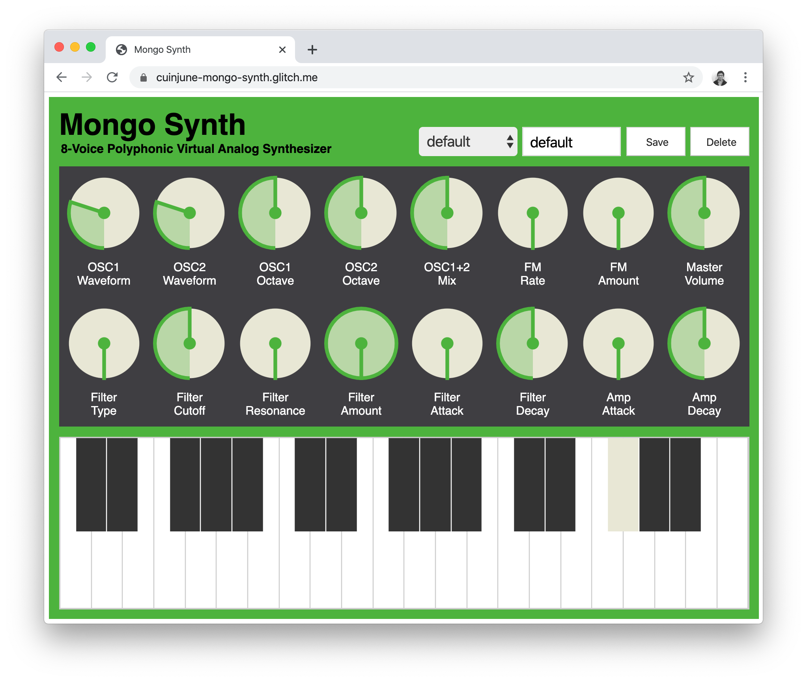

# Mongo Synth

This is the final assignment for the ITP class Dynamic Web Development.<br />
The assignment was to use all of the experience and knowledge I have gained in this class to create a full-stack web application.

I created a music synthesizer application which users can load, save, or delete presets that are stored in the MongoDB database.

Here's the [Live Demo on Glitch](https://cuinjune-mongo-synth.glitch.me/)


And here you can find the [List of Mongo Synth APIs](API.md)

## Setup
1. Installation of node.js is required. Follow [this guide](https://github.com/itp-dwd/2020-spring/blob/master/guides/installing-nodejs.md) to install it.
2. You need to create an `.env` file to have access to the MongoDB database. <br />
   Visit [MongoDB Atlas](https://www.mongodb.com/cloud/atlas) to create a cluster and get the connection string. <br />
   Add `MONGODB_URI='connection string with your password starting with mongodb+srv:'` to your `.env` file.
3. Run the following commands in the Terminal.
```
git clone https://github.com/cuinjune/mongo-synth.git
cd mongo-synth
npm install dependencies
npm start
```
3. Open your web browser and navigate to http://localhost:3000

## Author
* [Zack Lee](https://www.cuinjune.com/about): an MPS Candidate at [NYU ITP](https://itp.nyu.edu)
